## 1,4-DNI的介绍

1,4-二硝基咪唑(1,4-DNI)是合成抗菌抗原虫菌素罗硝唑、含能材料2,4-二硝基咪唑、2,4,5-三硝基咪唑的重要中间体。  

## 实验部分

> [!Warning]  
> **浓硫酸有强腐蚀性**  
> **乙酸酐和甲醇有毒性且易燃**  
> **二氯甲烷有毒性**

### 所需试剂和仪器

**试剂** 

* 二氯甲烷（AR）
* 浓硫酸（AR）
* 甲醇（AR）
* 硝酸铵（AR）
* 乙酸酐（AR）
* 4-硝基咪唑

**仪器**

* 电子称
* 烧杯
* 量杯
* 量筒
* 三角烧杯
* 标准口三口烧瓶
* 烧瓶
* 蛇形冷凝管
* 球形冷凝管
* 梨形分液漏斗
* 铁架台
* 抽滤一套
* 电子温度计
* 四氟聚乙烯塞
* JJ-1电动搅拌机
* 控温电热套
* 循环水泵

### 步骤

* 11.3g的自制纯`4-硝基咪唑`（重结晶精制后的），50ml`乙酸酐`。  
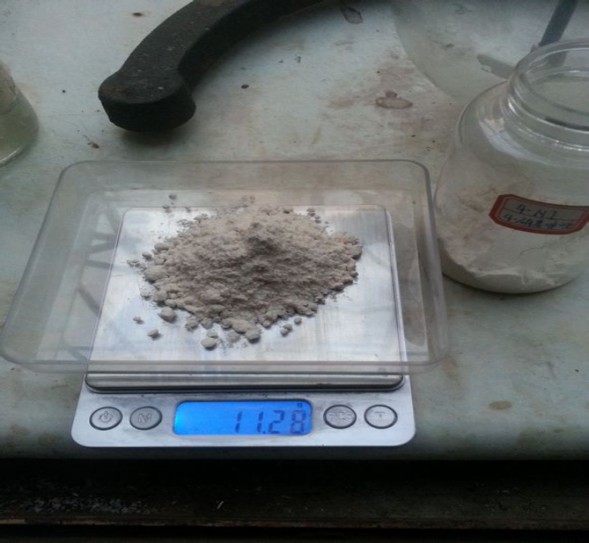
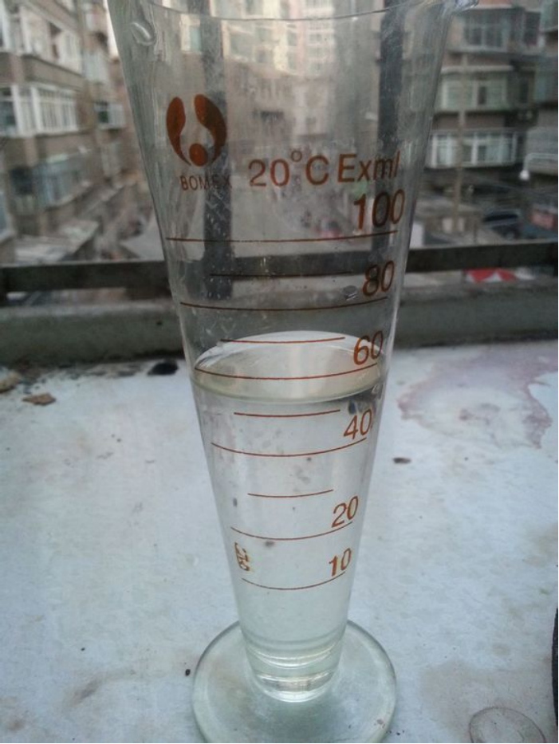  
* 冰水浴下将`4-硝基咪唑`加入50ml`乙酸酐`，然后再加入20ml`乙酸酐`。  
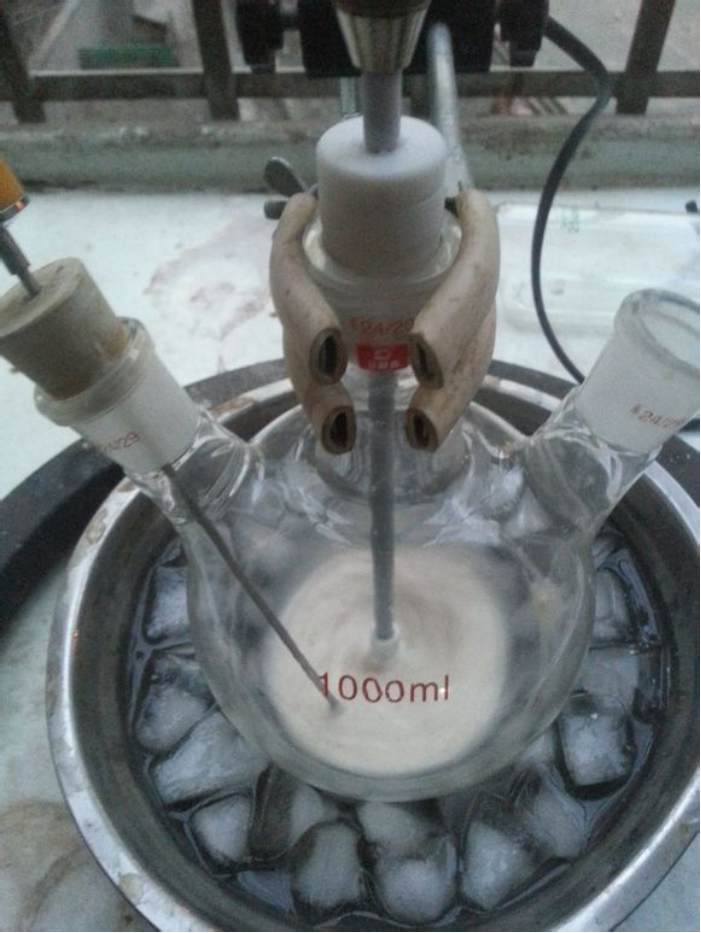  
* 量取8ml`浓硫酸`。  
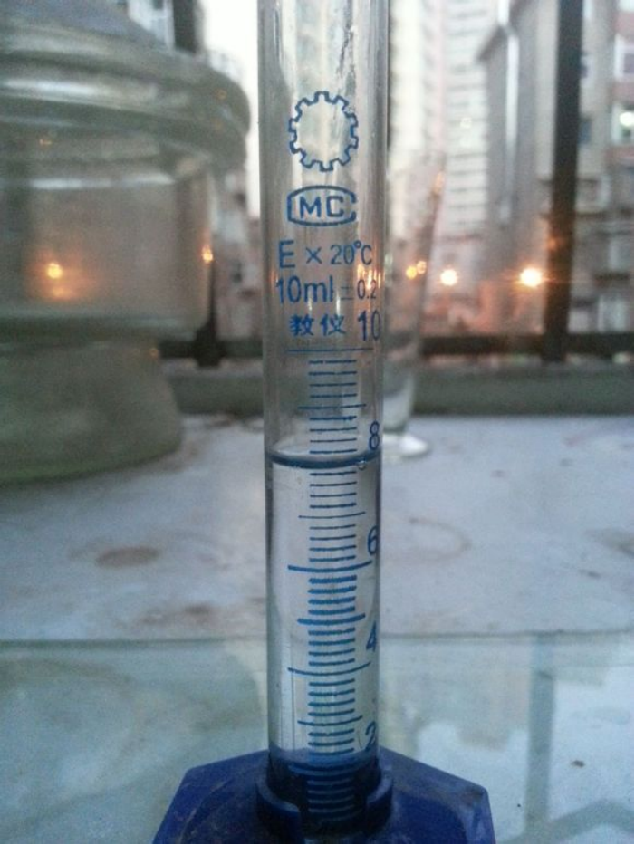  
* 缓慢加入`烧瓶`中，控制温度在20度以下。  
放热剧烈（1ml能让温度上升11度）加完后固体全部溶解。  
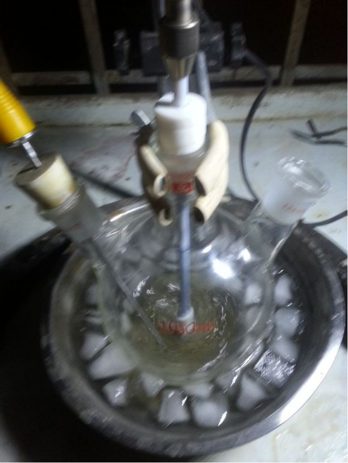  
* 升温至35度左右。  
  
* 加上回流装置，35度左右反应一小时。  
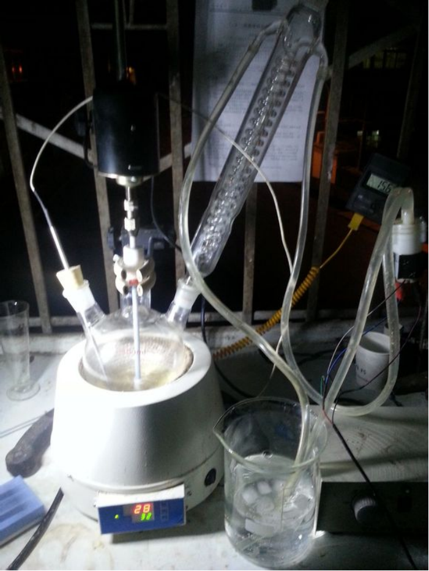  
* 在10度以下缓慢加入20g`硝酸铵`。  
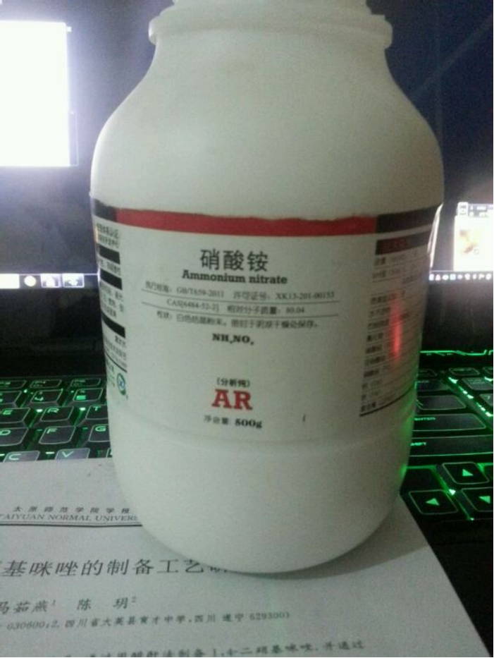
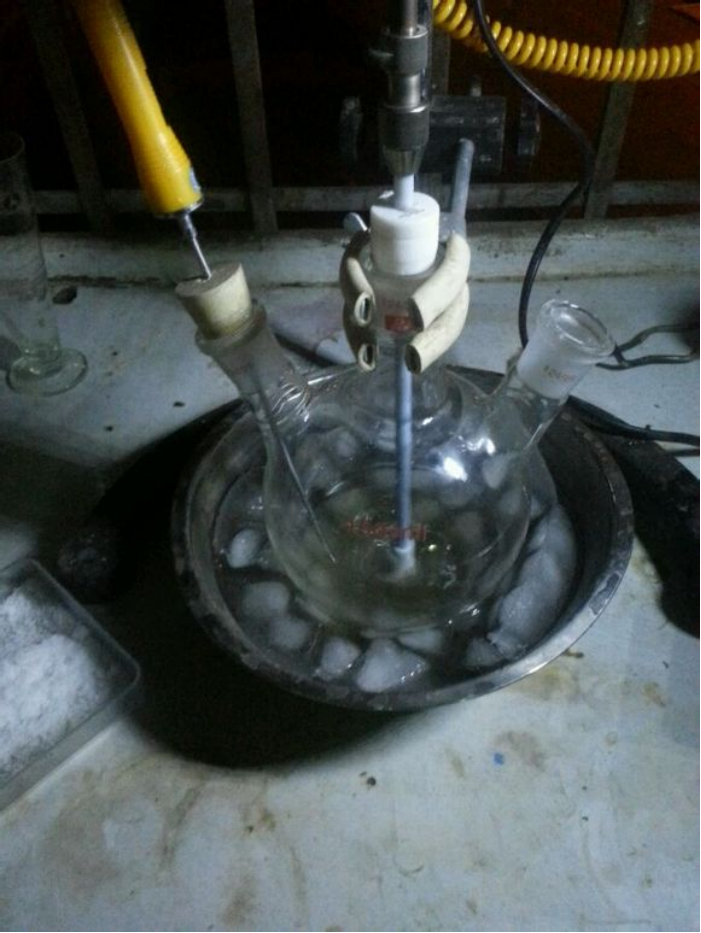  
* 加完后升温到35-40度反应1.5h。
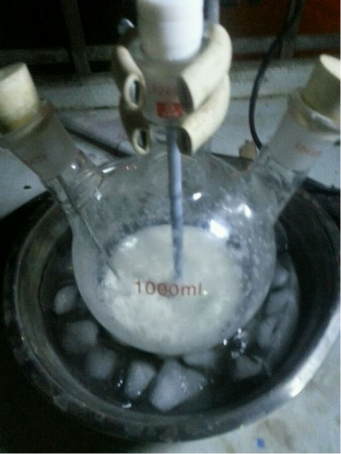  
* 反应完后倒入200ml水中，得到微黄色溶液，用`二氯乙烷`萃取。  
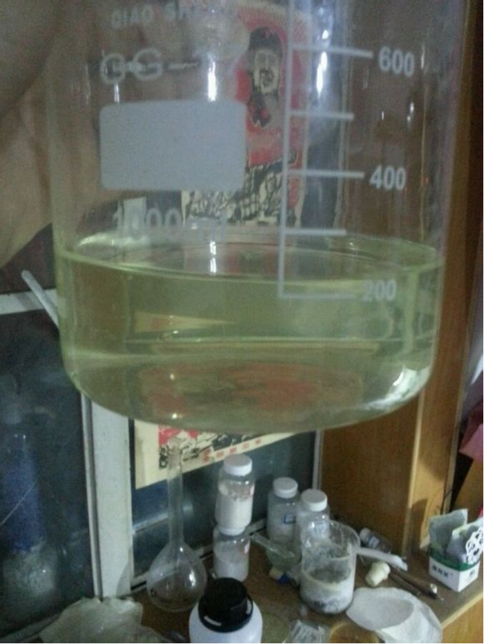
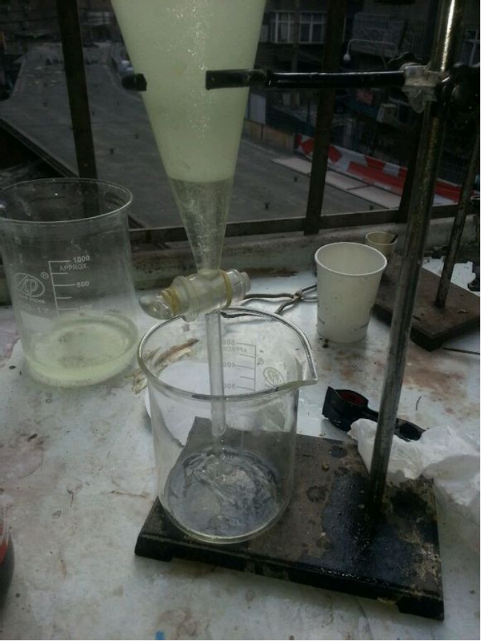  
* 减压蒸馏。
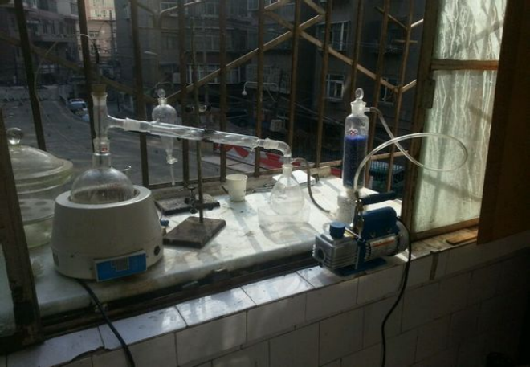
* 快蒸发干的时候加入少许`甲醇`，回流半小时。  
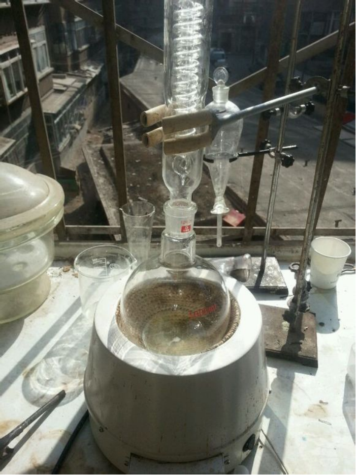   
* 自然蒸干，得到**1,4-DNI**。  
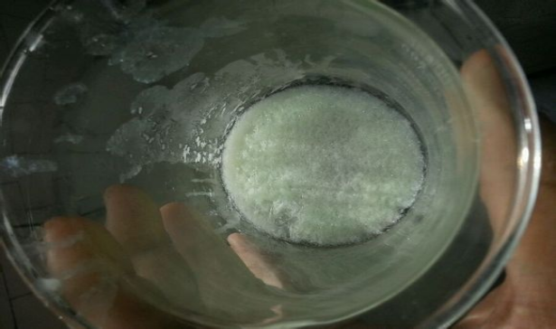  

## 备注

如果您遵循本指南的制作流程而发现问题或可以改进的流程，请提出 Issue 或 Pull request 。