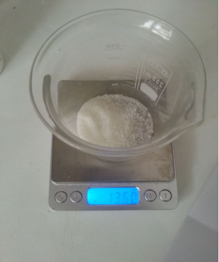
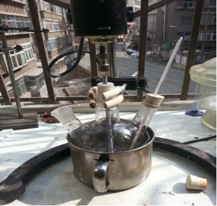
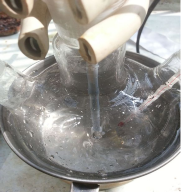
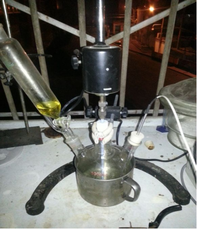
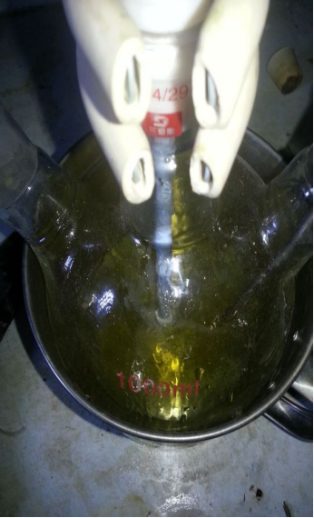
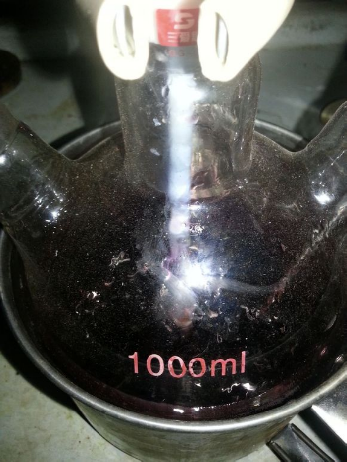
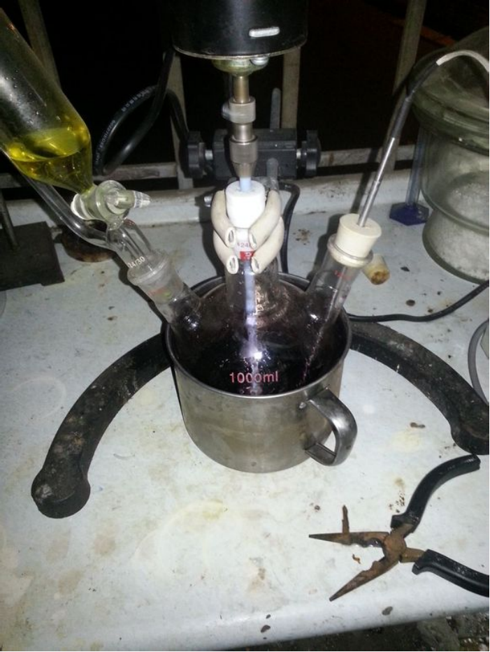
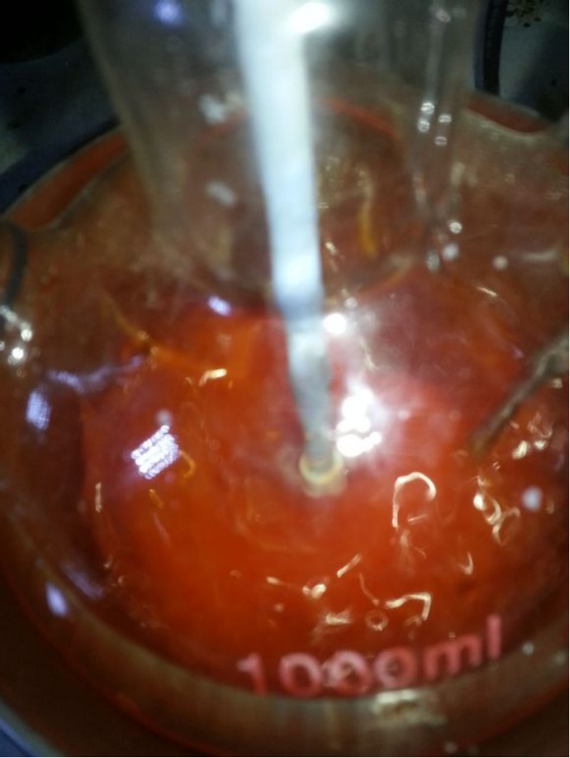
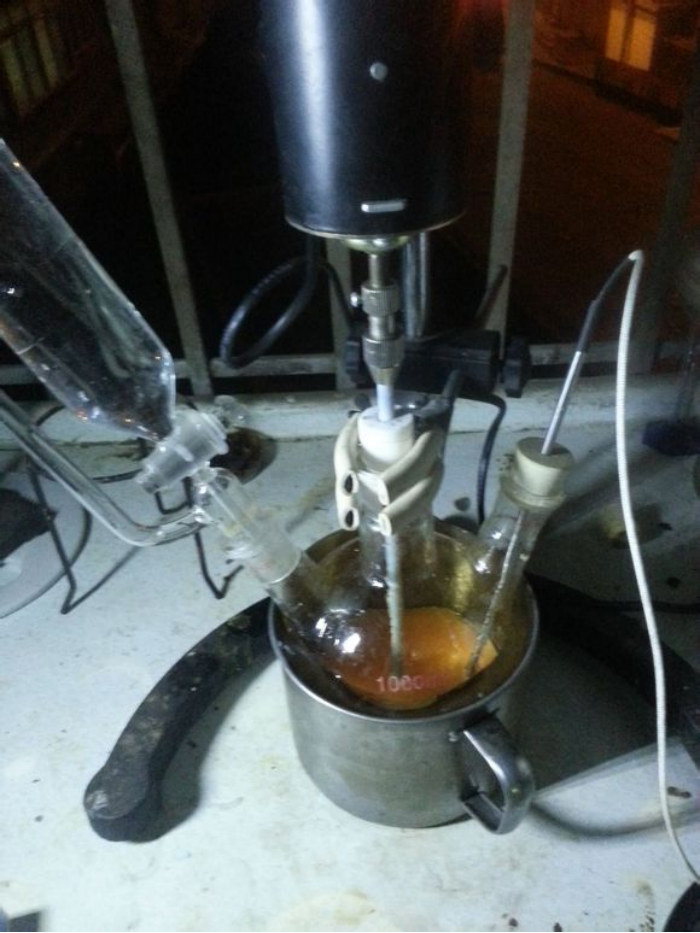
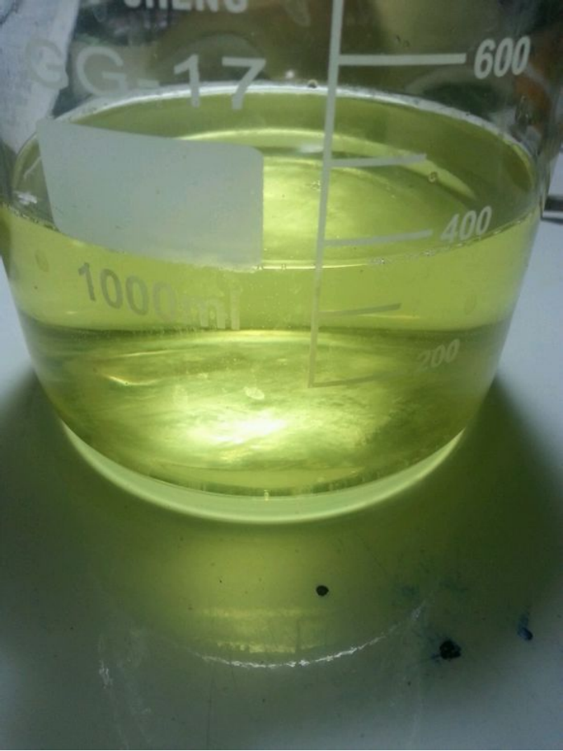

## FOX-7的介绍

FOX-7由1998年首次被报道，为一很有前景的高能顿感材料。  
生成热为 -134.4kJ/mol（RDX -70.8kJ/mol）  

理论爆速爆压  

* （Keshavarz方法）8973m/s 36.4Gpa（1.885）RDX 8723m/s 35.2Gpa（1.816）  
* （kamlet经验方法）9000m/s 35.9Gpa（1.885）RDX 8854m/s 34.96Gpa（1.816）  

理论铅柱扩张 540ml  
理论爆温（卡斯特方法）4491K  
理论爆热

* （盖斯定律）6225KJ/KG  
* （经验算法）6082KJ/KG  

理论做功能力 2019.19KJ/KG（同比RDX 1830KJ/KG）

但FOX-7的亮点不在于他的爆轰性能，而是在于他的感度。  

* FOX-7的感度远远低于RDX，在某些方面甚至比TNT还要顿感。  
* FOX-7的撞击感度（BAM 2kg落锤）为126cm（RDX 35cm），摩擦感度（JP摆）>350N（RDX 120N）。  
* 与常用粘结剂均有良好的相容性。  

### FOX-7的合成路线，主要有三条

* 以2-甲基咪唑为原料，硝化得2-二硝基亚甲基-4,5-咪唑烷二酮后用不同方法开环制得。  
开环方法包括氨水开环，无机强酸开环，水开环等。  
但是除水开环外，其他开环方法产率均较低而且副产物较多，需要使用昂贵的TFA来进行提纯，水开环法产率最高（35%）且不需用TFA洗涤。  
* 以2-甲氧基-2-甲基-4,5-咪唑二酮为原料，经硝化得到2-二硝基亚甲基-4,5-咪唑烷二酮再经开环制得到。  
该方法产率低，工艺复杂，实用性不高。
* 以2-甲基-4,6-嘧啶二酮为原料，硝化得到2-二硝基亚甲基-5,5-二硝基-2H-嘧啶-4,6-二酮,再水解制得。  
该方法产率较高（80%）纯度较好，已实现工业化生产，为最具有前途的方法，但2-甲基-4,6-嘧啶二酮的前体盐酸乙脒的制取有些困难。

## 实验部分

> [!Warning]  
> **浓硫酸和发烟硝酸有强腐蚀性**

### 方案

本次试验采用第一种方法，以2-甲基咪唑为原料，水为开环试剂，通过一系列反应来制取FOX-7。  

**机理如下**  

* 2-甲基-4-二氢-5-咪唑啉酮进一步硝化得到2-二硝基亚甲基-4,5-咪唑烷二酮（具有酰胺的结构），酰胺很容易水解，开环后产物就是FOX-7。

* 因为有不同中间体的生成，反应在不同阶段呈现出不同的颜色，大致为无色>黄色>黑色>紫色>红棕色>橙黄色。

### 所需试剂和仪器

**试剂** 

* 2-甲基咪唑
* 98%浓硫酸
* 发烟硝酸
* 蒸馏水

**仪器**

* 电子秤
* 烧杯
* 水浴锅
* 三口烧瓶
* 机械搅拌机
* 温度计
* 铁架台
* 橡胶塞
* 恒压滴液漏斗
* 干燥器

### 步骤

* 快速称取13.6g`2-甲基咪唑`。  
  
* 搅拌冰水浴下缓慢将`2-甲基咪唑`加入160ml`98%浓硫酸`中，控温20度以下，这里需要注意的是，`2-甲基咪唑`是吸湿的，暴露在空气中太久会粘在烧杯壁上，所以我把他放在右边的`干燥器`里了。  
  
* 加完后略浑浊，稍微搅拌下澄清后进行下一步。  
  
* 量取32ml`发烟硝酸`，搅拌下用`恒压滴液漏斗`缓慢滴入，控温20下。  
  
* 5min后，进入黄色阶段  
  
* 10min后黄色加深  
  
* 45min后进入黑色阶段  
  
* 1h后进入紫色阶段（紫色和黑色差不多，这两个的时间我主观判断的） 
  
* 1h25min后进入红棕色阶段  
  
* 1h35min后`发烟硝酸`快加完了，产物接近橙黄色  
  
* 1h50min后`发烟硝酸`滴加完毕，产物完全变成了橙黄色  
  
* 缓慢滴加200ml`蒸馏水`开环，控温20度左右。**这一步放热和硝化时放热差不多，我就是在这一步被坑，3ml水一下进去温度直接飙到35度。**  
  

## 备注

如果您遵循本指南的制作流程而发现问题或可以改进的流程，请提出 Issue 或 Pull request 。