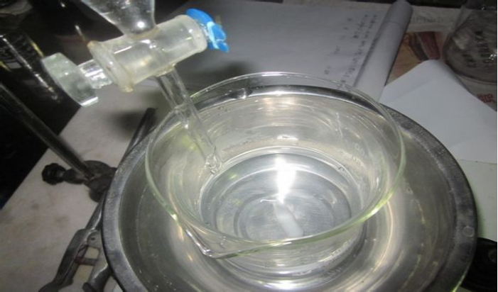
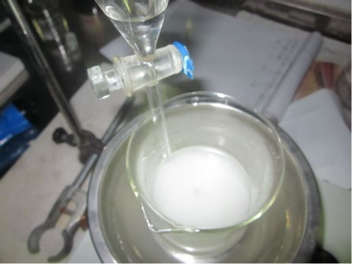
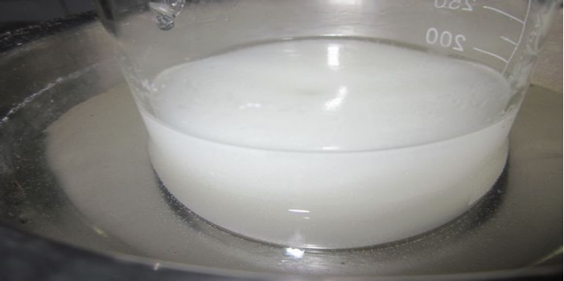
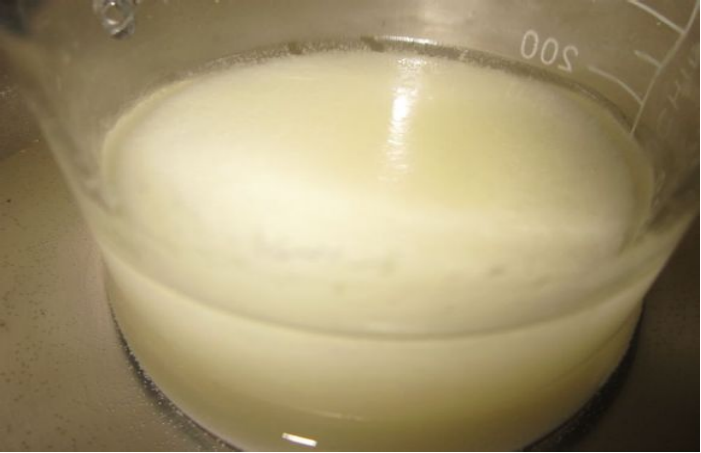
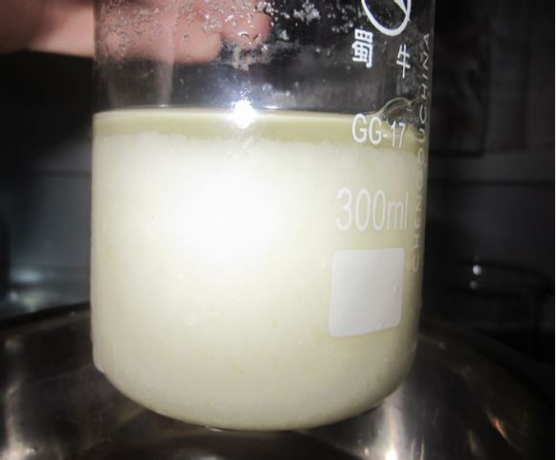
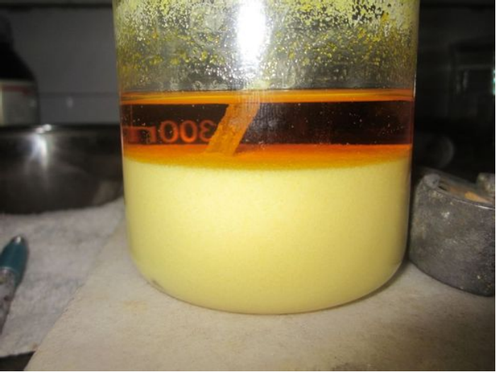
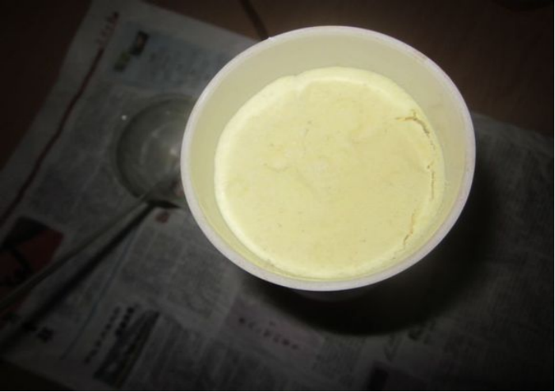
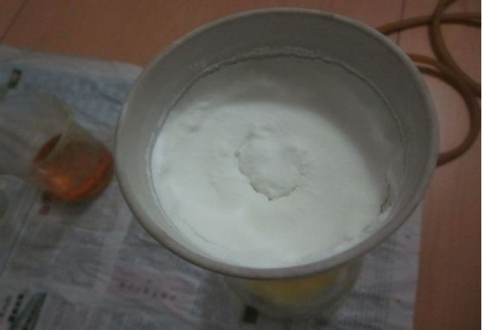

## HBIW的介绍

2,4,6,8,10,12-六硝基-2,4,6,8,10,12-六氮杂异伍兹烷，简称六硝基六氮杂异伍兹烷、HNIW，俗称CL-20。  
具有笼型多环硝胺结构的一个高能量密度化合物，分子式为C6H6N12O12，为白色结晶，是目前已知能够实际应用的能量最高、威力最强大的非核单质炸药。  
它由美国的尼尔森（Nielson）博士于1987年首先制得，主要用作推进剂的组分。  
1998年，中国的化学家完成了该物质的合成。

## 实验部分

> [!Warning]  
> **乙腈有毒性且易燃**
> **丙酮有肝脏毒性**

### 所需试剂和仪器

**试剂** 

* 对甲苯磺酸
* 40%乙二醛
* 苄胺
* 乙腈
* 丙酮

**仪器**

* 烧杯
* 水浴锅
* 铁架台
* 滴液漏斗
* 抽滤装置

### 步骤

* 向300ml`烧杯`中加入`乙腈`150ml，`苄胺`18ml，`对甲苯磺酸`2.8g，搅拌20min。  
水浴冷却保持温度不超过20℃，1.5h内滴加`40%乙二醛`8.7ml，滴加完毕后向`滴液漏斗`中加入水15ml，并入`烧杯`中。  
  
* `乙二醛`滴入三分之一后出现白色浑浊。  
  
* 滴加完毕后继续搅拌15min，在室温下（不超过30℃），放置24h，每隔数小时，搅拌10min左右。  
滴加完毕后：  
  
* 放置一段时间后，体系开始变黄，并且聚为一团成为絮状沉淀，这与甲酸催化法显然不同（甲酸催化时得到的**HBIW**为细小晶体状）。  
 
  
* 颜色逐渐变黄，并且絮状沉淀逐渐分散开。  
  
* 过滤产物。  
  
* 用50ml冷`乙腈`分两次洗涤滤饼，晾干，得到较白的**HBIW**粗品13.3g，产率82.4%，纯度约95%。 
  
* **HBIW**的精制：将12克粗品**HBIW**加入150ml`丙酮`中，搅拌下，20分钟内水浴升温至沸腾，至沸腾后继续搅拌5min，静置下冷却至室温，过滤后用20ml冷`乙腈`洗涤一次后晾干。  
得到几乎纯白色晶体11克左右。  

## 备注

如果您遵循本指南的制作流程而发现问题或可以改进的流程，请提出 Issue 或 Pull request 。